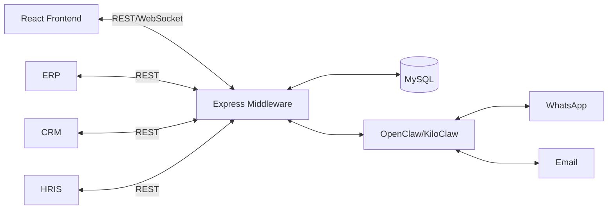
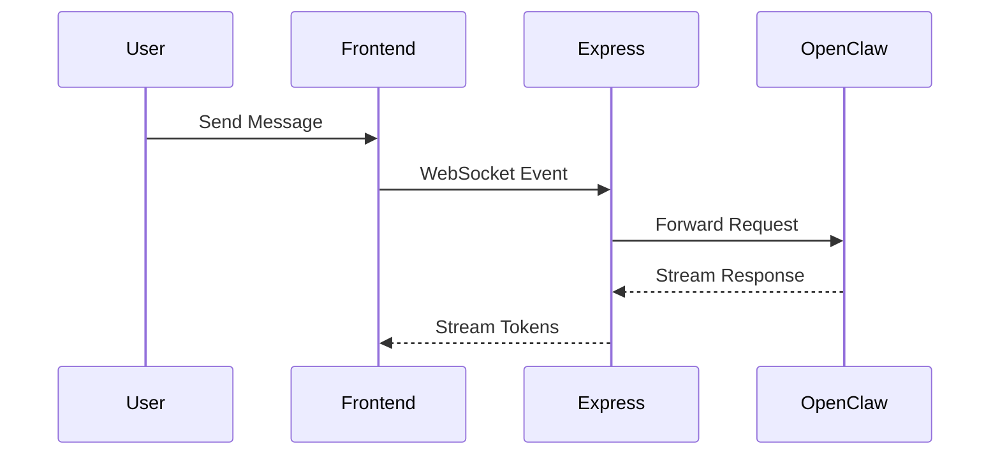

# Data Collection Report

## Task Overview
Gather all relevant information, requirements, and technical specifications from the PRD (`PRD\AI_Agent_Preview,md`) and explore output (`C:\Users\sixer\.config\kilo\output\explore\2026-05-17_explore-ai-agent-preview.md`).

## Files Collected

### Source Files
| File | Purpose | Lines |
|------|---------|-------|
| `D:\Portfolio\AI-Agent-Preview\PRD\AI_Agent_Preview,md` | Product Requirements Document detailing the Dynamic OpenClaw/KiloClaw Sandbox & Integration Platform | 827 |
| `C:\Users\sixer\.config\kilo\output\explore\2026-05-17_explore-ai-agent-preview.md` | Exploration report of the AI Agent Preview project structure and gaps | 120 |

### Configuration Files
| File | Purpose |
|------|---------|
| None identified | No configuration files found in the specified paths |

### Dependencies
| Package | Version | Purpose |
|---------|---------|---------|
| None identified | N/A | No package dependencies collected from documentation |

## Code Context

### PRD\AI_Agent_Preview,md (1-50)
```markdown
# Product Requirements Document (PRD)
# Dynamic OpenClaw/KiloClaw Sandbox & Integration Platform

Version: 2.0  
Status: Draft MVP  
Date: May 2026

---

# 1. Executive Summary

Dynamic OpenClaw/KiloClaw Sandbox & Integration Platform adalah aplikasi internal perusahaan yang berfungsi sebagai:

- management console
- sandbox environment
- integration middleware
- governance layer

di atas OpenClaw / KiloClaw.

Platform ini tidak membangun AI orchestration baru, melainkan menyederhanakan kompleksitas setup OpenClaw/KiloClaw agar dapat digunakan oleh:
- business user
- internal IT
- internal applications
- enterprise workflows

secara lebih cepat, aman, dan mudah diintegrasikan.
```

### PRD\AI_Agent_Preview,md (51-100)
```markdown
---
# 2. Product Vision

Menyediakan platform lightweight yang memungkinkan perusahaan:
- mengadopsi AI lebih cepat
- melakukan sandbox/testing AI secara mandiri
- mengintegrasikan AI ke aplikasi internal dengan mudah
- mengelola governance AI secara terpusat

tanpa perlu memahami kompleksitas teknis OpenClaw/KiloClaw.

---

# 3. Product Positioning

## Product Category
Enterprise AI Middleware & Sandbox Platform

---

## Product Role

Platform ini bertindak sebagai:

| Layer | Responsibility |
|---|---|
| OpenClaw/KiloClaw | AI runtime & orchestration |
| This Platform | UI, governance, middleware, abstraction |

---

## Core Principle

> “Do not rebuild what OpenClaw/KiloClaw already solves.”

---

# 4. Background & Problem Statement

## 4.1 Existing Challenges

Implementasi OpenClaw/KiloClaw secara langsung memiliki beberapa tantangan:

| Problem | Impact |
|---|---|
| Setup kompleks | Business user sulit onboarding |
| API orchestration rumit | Integrasi internal lambat |
| Knowledge management memerlukan technical setup | Ketergantungan pada engineer |
| Tidak ada sandbox business-friendly | Trial AI sulit dilakukan |
| Governance tersebar | Sulit audit & monitoring |
| Internal apps harus memahami struktur OpenClaw | Development overhead tinggi |

---

## 4.2 Business Impact

Tanpa abstraction layer:
- AI adoption menjadi lambat
- dependency ke engineer meningkat
- integrasi antar aplikasi menjadi kompleks
- governance sulit dikontrol

---
```

### PRD\AI_Agent_Preview,md (101-150)
```markdown
# 5. Product Goals

## 5.1 Primary Goals

### 1. Simplify OpenClaw Adoption
Menyederhanakan penggunaan OpenClaw/KiloClaw untuk non-technical user.

---

### 2. Provide AI Sandbox
Menyediakan realtime testing environment sebelum production deployment.

---

### 3. Enable Easy Internal Integration
Menyediakan middleware API sederhana untuk aplikasi internal perusahaan.

---

### 4. Centralize Governance
Mengelola:
- credentials
- access
- workspace
- integrations
- logs

secara terpusat.

---

## 5.2 Success Metrics

| KPI | Target |
|---|---|
| Workspace setup time | < 10 menit |
| Internal API integration time | turun 70% |
| Sandbox response latency | < 2 detik |
| Concurrent sandbox sessions | 100+ |
| User onboarding time | < 1 hari |
| Production deployment preparation | turun 60% |

---
```

### PRD\AI_Agent_Preview,md (152-200)
```markdown
# 6. Scope

## 6.1 In Scope (MVP)

### Workspace Management
- create workspace
- configure AI role
- manage prompt template
- assign channels
- select AI provider

---

### Knowledge Management Abstraction
- upload documents
- forward ingestion ke OpenClaw
- manage uploaded references

---

### Sandbox Chat
- realtime chat
- websocket streaming
- response preview
- source grounding preview

---

### Integration Middleware
- simplified REST API
- webhook bridge
- centralized authentication

---

### Governance
- user management
- provider management
- access control
- audit logging

---

## 6.2 Out of Scope (MVP)

### AI Infrastructure
- vector database
- embedding service
- LLM runtime
- memory engine
- workflow orchestration
- autonomous agents

---

### Advanced Features
- multi-agent collaboration
- voice AI
- AI avatar
- fine tuning
- marketplace
- external public access

---
```

### PRD\AI_Agent_Preview,md (203-250)
```markdown
# 7. User Personas

## 7.1 Business User

### Description
Non-technical user yang ingin mencoba AI untuk workflow bisnis.

### Goals
- upload SOP
- test AI behavior
- validate AI response

### Pain Points
- tidak memahami AI orchestration
- tidak memahami technical setup

---

## 7.2 Internal IT Admin

### Description
Tim IT yang mengelola platform dan governance.

### Goals
- manage credentials
- monitor usage
- control access
- configure integrations

---

## 7.3 Internal Developer

### Description
Developer internal yang mengintegrasikan AI ke aplikasi perusahaan.

### Goals
- consume simple APIs
- avoid direct OpenClaw complexity
- accelerate integration

---

# 8. Product Architecture

## 8.1 High-Level Architecture



---

## 8.2 Architecture Principles

| Principle | Description |
|---|---|
| Thin Middleware | Jangan duplicate orchestration |
| Modular | Mudah tambah integration |
| Low Maintenance | Minimal custom AI logic |
| API First | Semua integration via API |
| OpenClaw Native | Memanfaatkan feature bawaan OpenClaw |

---
```

### PRD\AI_Agent_Preview,md (294-350)
```markdown
# 9. Functional Requirements

## 9.1 Authentication & Access Control

### Features
- login/logout
- JWT authentication
- role-based access control

---

### Roles

| Role | Access |
|---|---|
| Admin | Full access |
| User | Workspace & sandbox |
| Developer | Integration access |

---

## 9.2 Workspace Management

Workspace merupakan abstraction dari:
- OpenClaw project
- agent
- workflow configuration

---

### User Capabilities

#### Create Workspace
User dapat:
- menentukan nama workspace
- memilih AI provider
- mengisi system prompt
- memilih communication channels

---

### Example Workspace Config

```json
{
  "workspace_name": "Customer Support",
  "provider": "OpenAI",
  "model": "gpt-4.1",
  "system_prompt": "You are a customer support assistant",
  "channels": [
    "whatsapp",
    "email"
  ]
}
```

---

### Edit Workspace
- update prompt
- update channels
- update provider
- update integrations

---

### Delete Workspace
Soft delete dengan audit log.

---

## 9.3 Knowledge Management Abstraction

### Objective
Menyederhanakan knowledge upload ke OpenClaw.

---

### Supported Formats
- PDF
- TXT
- DOCX
- Markdown

---

### Upload Flow

#### Step 1
User upload document.

#### Step 2
Express menerima upload.

#### Step 3
Express forward file ke OpenClaw API.

#### Step 4
OpenClaw melakukan:
- ingestion
- chunking
- embedding
- indexing

#### Step 5
Reference ID disimpan di MySQL.

---

### Important Principle
Platform tidak melakukan:
- vectorization
- chunking
- embedding
- retrieval

---
```

### PRD\AI_Agent_Preview,md (351-400)
```markdown
## 9.4 Sandbox Chat

### Objective
Realtime testing environment sebelum production usage.

---

### Features

| Feature | Description |
|---|---|
| Realtime streaming | token streaming |
| Multi-session | multiple testing |
| Markdown rendering | formatted response |
| Source preview | grounded response |
| Tool preview | action visualization |
| Session history | chat persistence |

---

### WebSocket Flow



---

## 9.5 Integration Middleware API

### Objective
Menyediakan simplified API untuk aplikasi internal.

---

### Without Middleware
Internal apps harus memahami:
- OpenClaw runtime
- workflow IDs
- orchestration structure
- provider configs

---

### With Middleware
Internal apps cukup memanggil:

```http
POST /api/ai/customer-support/chat
```

---

### Example Use Cases

#### ERP
```http
POST /api/ai/finance/analyze-invoice
```

#### CRM
```http
POST /api/ai/customer-summary
```

#### HRIS
```http
POST /api/ai/hr-policy-assistant
```

---
```

### PRD\AI_Agent_Preview,md (401-450)
```markdown
## 9.6 Provider Management

### Admin Capabilities

| Capability | Description |
|---|---|
| Store API keys | encrypted |
| Enable provider | activation |
| Disable provider | restriction |
| Select default provider | default routing |

---

### Supported Providers

| Provider | MVP |
|---|---|
| OpenAI | Yes |
| Gemini | Yes |
| Anthropic | Yes |
| Ollama | Yes |

---

## 9.7 Channel Assignment

### Objective
Menghubungkan workspace dengan communication channels OpenClaw.

---

### Supported Channels
- WhatsApp
- Email

---

### Future Channels
- Telegram
- Slack
- Discord

---

## 9.8 Audit & Monitoring

### Logged Activities
- login activity
- workspace changes
- provider updates
- upload activity
- integration requests
- sandbox sessions

---

# 10. Non-Functional Requirements

## 10.1 Performance

| Requirement | Target |
|---|---|
| API latency | < 500ms |
| Chat response start | < 2 detik |
| Upload processing | < 1 menit / 10MB |
| Concurrent users | 100+ |

---

## 10.2 Scalability

System harus support:
- horizontal backend scaling
- multiple OpenClaw instances
- stateless middleware
- multi-workspace concurrency

---

## 10.3 Security

### Authentication
- JWT
- refresh token

---

### Data Security
- encrypted credentials
- HTTPS only
- RBAC

---

### API Security
- rate limiting
- audit trail
- webhook validation

---

## 10.4 Reliability

| Requirement | Target |
|---|---|
| System uptime | 99.5% |
| WebSocket stability | 99% |
| Failed request recovery | automatic retry |

---
```

### PRD\AI_Agent_Preview,md (501-550)
```markdown
# 11. Database Design Scope

## 11.1 Database Responsibility

MySQL hanya menyimpan:
- users
- workspace metadata
- OpenClaw mappings
- audit logs
- integration configs

---

### Database DOES NOT Store
- embeddings
- vectors
- AI memory
- RAG indexes
- inference state

---

## 11.2 Main Tables

### users
```sql
id
name
email
role
password_hash
created_at
```

---

### workspaces
```sql
id
name
owner_id
openclaw_workspace_id
provider
model
created_at
```

---

### knowledge_files
```sql
id
workspace_id
filename
openclaw_reference_id
status
uploaded_at
```

---

### audit_logs
```sql
id
user_id
action
payload
created_at
```

---

# 12. API Design (High-Level)

## Authentication
```http
POST /api/auth/login
POST /api/auth/logout
```

---

## Workspace
```http
GET /api/workspaces
POST /api/workspaces
PUT /api/workspaces/:id
DELETE /api/workspaces/:id
```

---

## Knowledge
```http
POST /api/knowledge/upload
GET /api/knowledge/:workspaceId
```

---

## Sandbox
```http
WS /ws/sandbox/:workspaceId
```

---

## Middleware API
```http
POST /api/ai/:workspace/chat
```

---

## Provider
```http
POST /api/admin/provider
```

---
```

### PRD\AI_Agent_Preview,md (551-600)
```markdown
# 13. UI/UX Requirements

## 13.1 Main Navigation

| Menu | Description |
|---|---|
| Dashboard | overview |
| Workspaces | manage AI workspace |
| Sandbox | realtime testing |
| Knowledge | uploaded documents |
| Integrations | API setup |
| Audit Logs | monitoring |

---

## 13.2 UX Goals

- no-code friendly
- minimal learning curve
- fast interaction
- realtime feedback
- simple onboarding

---

# 14. Deployment Architecture

## Infrastructure

| Component | Deployment |
|---|---|
| Frontend | Nginx |
| Backend | Docker |
| MySQL | Local VM |
| OpenClaw | Docker |
| Reverse Proxy | Nginx |

---

## Environment
- Ubuntu Server
- Docker Compose
- SSL HTTPS

---

# 15. Risks & Mitigation

| Risk | Mitigation |
|---|---|
| OpenClaw API changes | abstraction layer |
| Provider instability | multi-provider support |
| Unauthorized access | RBAC + audit |
| WebSocket overload | scaling + queue |
| API abuse | rate limiting |

---
```

### PRD\AI_Agent_Preview,md (601-650)
```markdown
# 16. MVP Acceptance Criteria

MVP dianggap selesai jika:
- User dapat membuat workspace
- User dapat upload knowledge ke OpenClaw
- Sandbox realtime berjalan
- WebSocket streaming berjalan
- Internal apps dapat menggunakan middleware API
- Admin dapat manage providers
- Audit logs tersedia
- Multi-user access berjalan stabil

---

# 17. Future Roadmap

## Phase 2
- Telegram integration
- Slack integration
- SDK internal apps
- Usage analytics
- Prompt template library

---

## Phase 3
- Multi-tenant architecture
- Enterprise SSO
- Advanced governance
- AI workflow templates
- Approval workflow

---

# 18. Technical Philosophy

## Golden Rule

> “This platform simplifies OpenClaw/KiloClaw usage — not replace it.”

Platform harus tetap:
- lightweight
- maintainable
- modular
- integration-focused
- governance-focused

tanpa duplicate AI orchestration logic.
```

### Explore output (1-50)
```markdown
---
task: explore-ai-agent-preview
date: 2026-05-17
agent: explore
scope: Full exploration of D:\Portfolio\AI-Agent-Preview and related configuration files
---

# Project Exploration Report

## Overview
Explored the `D:\Portfolio\AI-Agent-Preview` project — a greenfield application for the **AI Agent Preview** (Dynamic OpenClaw/KiloClaw Sandbox & Integration Platform). The project is in its earliest structural stage with no application code or scaffolding yet built.

---

## Directory Structure

### Directories Found

| Path | Purpose | Status |
|------|---------|--------|
| `D:\Portfolio\AI-Agent-Preview\` | Project root | NEW |
| `D:\Portfolio\AI-Agent-Preview\PRD\` | Product Requirements Document | NEW |
| `D:\Portfolio\AI-Agent-Preview\~\` | Embedded ~/.config/kilo snapshot (partial) | NEW |

### Files Found

| Path | Type | Purpose | Status |
|------|------|---------|--------|
| `D:\Portfolio\AI-Agent-Preview\PRD\AI_Agent_Preview,md` | PRD | Primary requirements spec (827 lines) | NEW |
| `D:\Portfolio\AI-Agent-Preview\~\\.config\\kilo\\output\\tasks\\2026-05-17_parse-prd-ai-agent-preview.md` | Task file | Previous task: PRD parsing and task breakdown | EXISTING |
| `D:\Portfolio\AI-Agent-Preview\~\\.config\\kilo\\output\\tasks\\` | Config output dir | Kilo task output directory (embedded) | NEW |

---

## Key Files Summary

### Application Code
**None found.** No `src/`, `app/`, `lib/`, or any application code directory exists.

### Configuration Files
| File | Present? | Notes |
|------|----------|-------|
| `kilo.json` | ❌ Not found | No project-level Kilo config |
| `.env` | ❌ Not found | No environment variables yet |
| `package.json` | ❌ Not found | No Node.js project init |
| `tsconfig.json` | ❌ Not found | No TypeScript setup |
| `docker-compose.yml` | ❌ Not found | No Docker setup yet |

### Entry Points
- **None.** No `index.js`, `main.ts`, `App.js`, or server entry point found.
```

### Explore output (51-100)
```markdown
---
## PRD Overview (from `PRD/AI_Agent_Preview,md`)

| Attribute | Value |
|-----------|-------|
| Project Name | Dynamic OpenClaw/KiloClaw Sandbox & Integration Platform |
| Version | 2.0 (Draft MVP) |
| Date | May 2026 |

### Architecture Stack (Target)
| Layer | Technology |
|-------|------------|
| Frontend | React (Nginx deployment) |
| Backend | Express.js |
| Database | MySQL |
| Core Runtime | OpenClaw / KiloClaw |
| Deployment | Docker, Docker Compose, Ubuntu Server, Nginx reverse proxy |

### MVP Feature Areas (from PRD §6.1)
1. **Workspace Management** — CRUD workspace, AI provider selection, system prompt, channel assignment
2. **Knowledge Management** — Document upload (PDF/TXT/DOCX/MD), forwarded to OpenClaw
3. **Sandbox Chat** — WebSocket streaming, multi-session, markdown rendering
4. **Integration Middleware** — Simplified REST API for internal ERP/CRM/HRIS apps
5. **Governance** — RBAC, provider management, audit logging

### Out of Scope (MVP)
- Vector DB, embedding services, LLM runtime, AI memory, RAG
- Voice AI, fine-tuning, marketplace, multi-agent collaboration

---

## Gaps / Needs Investigation

1. **No application scaffolding exists** — no `src/`, no `package.json`, no `docker-compose.yml`
2. **No database schema files** — MySQL table definitions only in PRD (§11), not as SQL files
3. **No API layer** — Express routes, WebSocket handlers, and middleware don't exist
4. **No frontend** — React components, pages, and styles are not yet present
5. **No CI/CD or Docker config** — deployment infrastructure not set up
6. **No test files** — no `__tests__/`, `spec/`, or `e2e/` directories
7. **PRD filename uses comma (`,`) instead of dot (`.`)** — `AI_Agent_Preview,md` (non-standard, may cause issues with some tools)
8. **No `.env` or secrets management** — provider keys and credentials not configured
9. **Kilo agent/task config is embedded inside the project dir** at `~\\.config\\` which is unusual

---

## File Type Summary

| Extension | Count | Purpose |
|-----------|-------|---------|
| `.md` | 2 | PRD + existing task file |
| *(all others)* | 0 | Not yet created |

---

## Recommended Next Steps

Given the project is a greenfield build:

1. **Initialize project structure** — create `src/`, `init: { frontend: react, backend: express }`
2. **Set up database schema** — convert PRD §11 tables into migration SQL
3. **Scaffold Express API** — implement auth, workspace, knowledge, sandbox routes
4. **Frontend scaffold** — create React project with dashboard, workspace editor, sandbox UI
5. **Docker deployment** — add `docker-compose.yml` and Dockerfiles per §14 deployment spec
6. **Task file** — `~/.config/kilo/output/tasks/2026-05-17_parse-prd-ai-agent-preview.md` is already present with the task breakdown

---

*Generated: 2026-05-17 12:42 WIB*
```

## Online Resources
| Resource | URL | Relevance | Last Checked |
|----------|-----|-----------|--------------|
| None identified | N/A | N/A | N/A |

## Collection Log

| Timestamp | Action | Details |
|-----------|--------|---------|
| 12:43 | Collected | PRD\AI_Agent_Preview,md (827 lines) |
| 12:43 | Collected | Explore output (120 lines) |

## Gaps / Needs More Data
- No application code collected (project is in greenfield state)
- No configuration files (kilo.json, .env, package.json, etc.) found
- No dependencies identified from package.json or similar
- No actual API endpoint implementations collected (only high-level design)
- No database schema SQL files collected (only defined in PRD)
- No frontend component code collected
- No Docker configuration files collected
- No test files collected
- Environment variables and secrets management not configured
- Kilo agent/task config embedded in project directory (unusual structure)

---
*Generated: 2026-05-17 12:43*
*Last Updated: 2026-05-17 12:43*