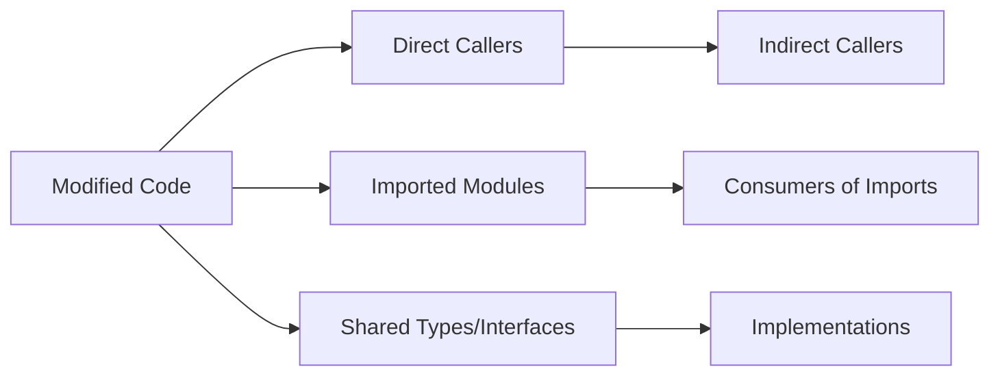

# Senior Code Review Skill

Review code produced by executors from a **senior/professional engineer perspective**. 
This is NOT basic linting or syntax checking — it challenges structural decisions, 
tracks dependency ripples, catches duplication, and validates cross-module integrity.

---

## Triggers

Use this skill when:
- "senior code review of this implementation"
- "review for duplication and maintainability"
- "check if this change breaks other parts of the system"
- "professional code quality assessment"
- "dependency impact analysis"
- "architecture review of the implementation"
- "cross-module reference validation"
- "code challenge — critique the executor's approach"

Do NOT use for trivial single-file changes where basic verification suffices,
or when the user explicitly asks for a quick check.

---

## Process

### Phase 0: Load Context

Before reviewing, gather the complete picture:

1. Read `/docs/YYYY_MM_DD_<judul-task>/structured_tasks.md` — original intent & constraints
2. Read `/docs/YYYY_MM_DD_<judul-task>/analysis_result.md` — technical requirements & 'why'
3. Read `/docs/YYYY_MM_DD_<judul-task>/implementation_plan.md` — what was planned
4. Read `/docs/YYYY_MM_DD_<judul-task>/implementation_report.md` — what was actually done
5. **Read ALL modified files** — understand the actual code changes
6. **Read referenced/affected files** — files imported, extended, or called by modified code

**NEVER** review based solely on the report. Read the actual code files.

---

### Phase 1: Code Structure Analysis

Evaluate the overall code organization:

| Aspect | What to Check | Red Flag |
|--------|---------------|----------|
| **Separation of Concerns** | Does each file/function have a single responsibility? | A function does multiple unrelated things |
| **Pattern Consistency** | Does the code follow the project's existing patterns? | Different style, architecture, or convention |
| **Abstraction Level** | Is the code at the right level of abstraction? | Mixing low-level details with high-level logic |
| **Module Boundaries** | Are module boundaries respected? | Crossing architectural layers (e.g., UI calling DB directly) |
| **Dead Code** | Are there unused variables, imports, or functions? | Orphaned code with no references |

**Output:** `STRUCTURE: PASS / CAUTION / FAIL` with specific file:line evidence.

---

### Phase 2: Dependency Impact Analysis

Trace how the changes ripple through the codebase:



#### 2a: Direct Impact
- **Import/Export changes**: Did the code add/remove/modify exports? Check ALL importers.
- **Function signature changes**: Did parameters, return types, or exceptions change? Check ALL callers.
- **Class/interface changes**: Did public API surface change? Check ALL consumers.

#### 2b: Indirect Impact
- **Dependency graph**: Trace transitive dependencies (A calls B calls C).
- **Side effects**: Does the modified code mutate shared state, singletons, globals, or caches?
- **Error propagation**: Do new error types bubble up correctly? Are try/catch blocks affected?

#### 2c: Contract Validation
- **API contracts**: Are existing endpoints' request/response formats preserved?
- **Database schema**: Do migrations maintain backward compatibility?
- **Configuration**: Are new config keys documented with defaults?

**Output:** `DEPENDENCIES: PASS / CAUTION / FAIL` with affected files and risk assessment.

---

### Phase 3: Duplication Detection

Scan for code duplication patterns:

| Pattern | What to Look For | Severity |
|---------|-----------------|----------|
| **Exact copy** | Identical code blocks >5 lines | 🔴 HIGH |
| **Near-copy** | Same logic with minor variable renaming | 🔴 HIGH |
| **Structural copy** | Same algorithm/pattern in different context | 🟡 MEDIUM |
| **Copy-paste with adaptation** | Similar logic adapted for slightly different use | 🟡 MEDIUM |
| **Boilerplate** | Repetitive setup/teardown patterns | 🟢 LOW |

**Check against:**
- Other files in the same module
- Other implementations of the same interface
- Utility functions that already exist in the codebase
- Common patterns (repository, factory, strategy) that could be abstracted

**Output:** `DUPLICATION: PASS / CAUTION / FAIL` with exact locations and suggested abstractions.

---

### Phase 4: Maintainability Assessment

Evaluate long-term maintainability:

#### 4a: Complexity
- **Cyclomatic complexity**: Are there deeply nested conditions/loops?
- **Function length**: Is any single function >50 lines?
- **Cognitive load**: Does a reader need to hold too much context?

#### 4b: Naming & Intent
- **Self-documenting code**: Do variable/function names reveal intent?
- **Magic values**: Are there unexplained numbers/strings?
- **Comments**: Are non-obvious decisions explained?

#### 4c: Testability & Safety
- **Test coverage**: Are edge cases, error paths, and boundary conditions tested?
- **Mockability**: Can dependencies be injected/stubbed for testing?
- **Defensive coding**: Are inputs validated? Are failure modes handled?

**Output:** `MAINTAINABILITY: PASS / CAUTION / FAIL` with specific recommendations.

---

### Phase 5: Reference Integrity

Validate that the implementation doesn't break other parts of the system:

#### 5a: Symbol Resolution
- All new imports point to existing paths/modules
- All function calls match target signatures
- All type references resolve correctly
- No circular imports introduced

#### 5b: Contract Preservation
- Public API signatures unchanged (unless explicitly required)
- Existing behavior preserved (no breaking changes to callers)
- Error behavior consistent with existing patterns

#### 5c: Workflow Integrity
- Does this change affect other documented workflows?
- Are there other agents/services that depend on this code?
- Is there a rollback path if this change causes issues?

**Output:** `REFERENCES: PASS / CAUTION / FAIL` with specific file:line references.

---

### Phase 6: Challenge & Report

#### 6a: Challenge Decisions
For each CAUTION or FAIL finding, challenge the executor's approach:

```
## Challenge: <topic>

**Executor's approach:** <what they did>

**Why it's problematic:** <specific issue>

**Suggested alternative:** <better approach>

**Risk if not fixed:** <what could go wrong in production>
```

**Challenge criteria — ask yourself:**
- "Would I approve this in a production code review?"
- "Is this the simplest thing that works correctly?"
- "Does this make the codebase better or worse over time?"
- "Will the next developer understand this in 6 months?"

#### 6b: Produce Final Report

```markdown
# Senior Code Review Report

## Summary
| Domain | Verdict | Issues |
|--------|---------|--------|
| Code Structure | PASS / CAUTION / FAIL | N |
| Dependency Impact | PASS / CAUTION / FAIL | N |
| Duplication | PASS / CAUTION / FAIL | N |
| Maintainability | PASS / CAUTION / FAIL | N |
| Reference Integrity | PASS / CAUTION / FAIL | N |

**Overall Verdict:** 
- ✅ **APPROVED** — all PASS, no blockers
- ⚠️ **APPROVED WITH COMMENTS** — CAUTION items addressed or accepted
- ❌ **CHANGES REQUESTED** — FAIL items must be fixed before merge

## Issues Log
| # | Severity | Domain | File:Line | Description | Recommendation |
|---|----------|--------|-----------|-------------|----------------|
| 1 | 🔴 High | Dep Impact | src/service.ts:42 | ... | ... |
| 2 | 🟡 Medium | Duplication | src/utils.ts:15 | ... | ... |

## Key Challenges
1. <challenge summary>
2. <challenge summary>

## Positive Findings
- <what was done well>
- <good design decisions>
```

---

## Execution Checklist

```
[ ] Phase 0: Context fully loaded (tasks + analysis + plan + report + code files)
[ ] Phase 1: Code Structure Analysis performed (PASS/CAUTION/FAIL)
[ ] Phase 2: Dependency Impact Analysis performed (direct + indirect + contracts)
[ ] Phase 3: Duplication Detection performed (exact + near + structural)
[ ] Phase 4: Maintainability Assessment performed (complexity + naming + testability)
[ ] Phase 5: Reference Integrity performed (symbols + contracts + workflows)
[ ] Phase 6: Challenges articulated + Final Report produced
[ ] Final verdict: APPROVED / APPROVED WITH COMMENTS / CHANGES REQUESTED
[ ] Issues logged with severity, location, recommendation
[ ] Evidence cited for every finding (file:line, exact quote)
```

---

## Anti-Patterns

| Avoid | Instead |
|-------|---------|
| Reviewing without reading the actual code files | Always read source files, not just the report |
| Commenting on style when there are structural issues | Prioritize structural, dependency, and integrity issues |
| Accepting duplication "just this once" | Every duplication is a future maintenance burden |
| Ignoring indirect callers | Trace the full dependency chain — even if it takes extra time |
| Rubber-stamping with no challenges | A senior review challenges at least one decision |
| Fixing issues yourself | You are a reviewer — report findings, let the executor fix them |
| Reviewing in isolation | Understand the original requirements before judging the implementation |

---

## Verification

After code review:
1. All modified files read and analyzed
2. All affected files (callers, consumers, dependents) checked
3. Every finding has specific evidence (file:line or exact quote)
4. Duplication checked against the full codebase scope (not just modified files)
5. Dependency impact traced at least 2 levels deep
6. Final verdict is clear and actionable
7. Positive findings included — good code deserves acknowledgment
